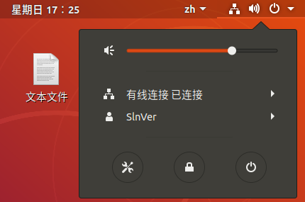

 
<!-- more -->
2020.8.30
最近开学忙，有个点想说给忘了，今天加上去

配置一圈后，虚拟机还是连不上网。

问题很有可能使网络的设置出错了。。。。。其实是很简单的一个点。

进入ubuntu系统后，右上角，网络连接，把有线链接打开。。。



可能就是因为这个点太简单太小了，很多博客里没有提这个事。我也是翻了很多才在一篇文章里找到这个问题。


2020.7.19


网上能搜到的基本是两种方法：

① 添加dns

②更换源

我用的是更换源的办法


相信大部分遇到这个问题的读者，此时此刻和我一样是个新手，对命令行的操作方式还不是很熟悉。

比如，通过命令行（ vi sources.list  ）打开文件之后不知道怎么修改，也不知道改没改上，也不知道咋返回原界面（＞︿＜

所以，我不用命令行啦！

直接打开文件-->其他位置-->计算机-->etc-->apt,就能看到sources.list文件。

在apt文件夹内，右键空白处，选择在终端中打开，然后输入

```c
sudo chmod 777 sources.list
```

将该文件修改为所有人都有读写权限，不然该文件默认是只读的，注意此处用到了sudo，所以如果你之前没设置过，你需要设置root账户

可以参考这篇博客：https://blog.csdn.net/ezreal_tao/article/details/86709308


然后右键sources.list文件-->用文本编辑器打开，删除全部内容，将下列内容粘贴进去

```bash
deb http://mirrors.aliyun.com/ubuntu/ vivid main restricted universe multiverse
deb http://mirrors.aliyun.com/ubuntu/ vivid-security main restricted universe multiverse
deb http://mirrors.aliyun.com/ubuntu/ vivid-updates main restricted universe multiverse
deb http://mirrors.aliyun.com/ubuntu/ vivid-proposed main restricted universe multiverse
deb http://mirrors.aliyun.com/ubuntu/ vivid-backports main restricted universe multiverse
deb-src http://mirrors.aliyun.com/ubuntu/ vivid main restricted universe multiverse
deb-src http://mirrors.aliyun.com/ubuntu/ vivid-security main restricted universe multiverse
deb-src http://mirrors.aliyun.com/ubuntu/ vivid-updates main restricted universe multiverse
deb-src http://mirrors.aliyun.com/ubuntu/ vivid-proposed main restricted universe multiverse
deb-src http://mirrors.aliyun.com/ubuntu/ vivid-backports main restricted universe multiverse12345678910
```

然后右上保存


接下来再修改回只读权限

```c
sudo chmod 644 sources.list
```

再运行

```c
sudo apt-get update
```


然后可能换源后还是无法解析域名（；´д｀）ゞ


